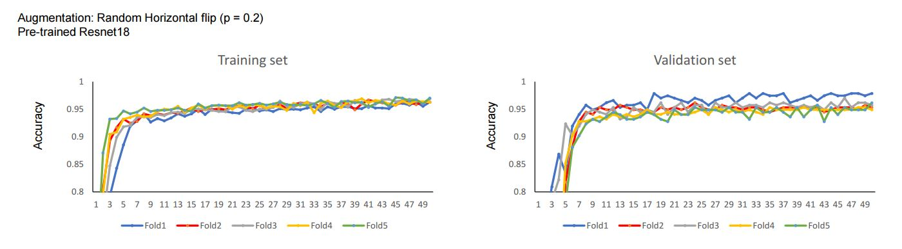
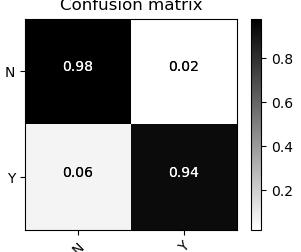

# Retina_classification

## Requirements
Python 3 

* pytorch == 1.10.2
* torch_geometric 
* numpy >= 1.17.5 
* scipy >= 1.1.0 
* scikit-learn >= 0.22.2
* matplotlib 
* natsort 
* torchvision
* itertools

## Files
We provide Python implementation for training the model, its evaluation and generate gradcam images.
* data_loader: Prepare data to input to the model
* retina_train.py: Train models
* train_pred.py: Train and prediction functions
* test_grad.py: Test data / save gradcam images
* utils.py: Save gradcam and overlap to input images
* Grad_cam.py: Calculate backpropagation and generate gradcam images
* plt_cm.py: Plot confusion matrix

python retina.py --k_folds 5 --train_data_path <path> --train_labels <path>

## Results
* Training and validation performances for pre-trained RESNET, Vanilla RESNET and pre-trained RESNET with augmentation

* Confusion matrix for pre-trained RESNET with augmentation

* Gradcam Results

